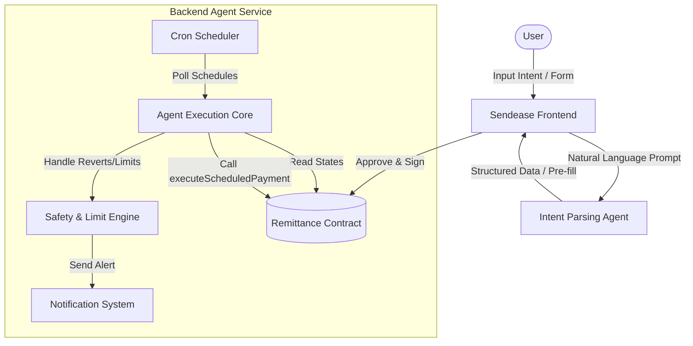
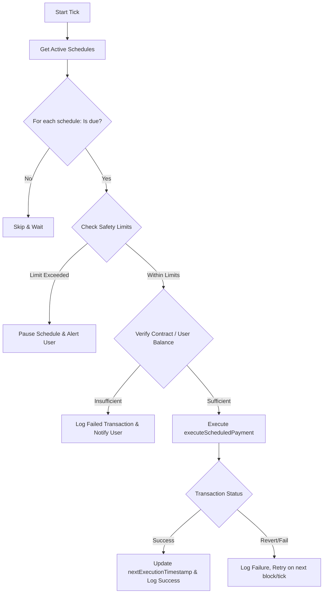

# Sendease AI Agent Architecture & Specification

Sendease is powered by an autonomous, economic AI agent that handles intent parsing, schedules monitoring, automated execution of transactions, and safety constraint enforcement on the Celo network for MiniPay users.

---

## 1. Agent Overview

The Sendease Agent has two primary areas of responsibility:
1. **Natural Language Processing (Intent Parsing Agent)**: Interacts with the user at setup time, translating colloquial instructions into structured data parameters.
2. **Autonomous Execution Engine (Remittance Agent)**: An active background service with real economic agency that monitors due schedules, validates safety limits, triggers transactions on Celo, and manages failures.

---

## 2. Agent Roles and Specifications

### 2.1 Intent Parsing Agent
This component runs on-demand when the user uses the natural language prompt input.
* **Input**: Free-text prompt (e.g., *"Kirim 100 USDm ke Ana tiap tanggal 1"*)
* **Output**: A structured JSON object containing:
  - `recipientName` (e.g., `"Ana"`)
  - `amount` (e.g., `100`)
  - `currency` (e.g., `"USDm"`)
  - `frequency` (e.g., `"Monthly"`)
  - `startDate` (e.g., Next occurrence of date 1)
* **LLM Engine**: Configured to parse fields accurately, requesting clarification or flagging missing info if crucial fields (like amount or recipient) are ambiguous.
* **Casing & Normalization**: Output parameters (like currency codes `USDm`) are preserved exactly with their correct standard casing. Since frontend display components do not use CSS `uppercase` text styling, the agent must output normalized values to avoid layout or format discrepancies.

### 2.2 Execution & Automation Agent
This component runs as a background service (scheduler daemon) using a dedicated agent hot-wallet.
* **State Management**:
  - Periodically queries the [RemittanceContract](file:///Users/vickyadifirmansyah/Documents/Projects/send-ease/PRD.md#L244) to find active, pending schedules.
  - Matches `nextExecutionTimestamp` with the block time.
* **Safety & Limit Checks**:
  - Before triggering a payment, the agent verifies if the transaction is within the user-defined `maxMonthlyAmount` safety limit.
  - If the limit is reached, it halts the transfer, updates status to `Paused`, and triggers a notification.
* **Onchain Execution**:
  - Initiates the `executeScheduledPayment(scheduleId)` transaction on the Celo Mainnet / Sepolia network.
  - Pays gas using its own funded wallet, acting with autonomous economic agency.

---

## 3. Detailed Workflows

### 3.1 Setup / Creation Flow
1. User provides natural language input.
2. Intent Agent parses and pre-fills the structured form.
3. User reviews details and signs the approval transaction in MiniPay.
4. The config is saved directly on-chain in the `RemittanceContract`.

### 3.2 Automated Execution Loop
Every cron tick, the agent runs through the following decision-making pipeline:

---

## 4. Onchain Identity & ERC-8004
To establish reputation, trust, and standardized identity within the Celo ecosystem, the agent implements **Self Agent ID** / **ERC-8004**:
* **Onchain Registry**: The agent's address is registered on-chain with its metadata (capabilities, owner, active networks).
* **Trust & Transparency**: All executions triggered by the agent are transparently verified via 8004scan / block explorer, allowing users to trace every automated transfer to Sendease's registered agent identity.

---

## 5. Error Handling and Resilience

| Scenario | Agent Response / Behavior |
| :--- | :--- |
| **Insufficient Wallet Funds** | Marks transaction as `Failed` in history, does not advance schedule date, and triggers a user notification. |
| **RPC / Network Timeout** | Implements an exponential backoff retry mechanism (TC-081) on subsequent scheduler ticks without duplicate charging. |
| **Monthly Limit Hit** | Automatically transitions the schedule state to `Paused` (TC-031) and notifies the user. |
| **User Cancel/Pause** | Once detected from contract state events, the agent removes the schedule from the active execution queue immediately. |
