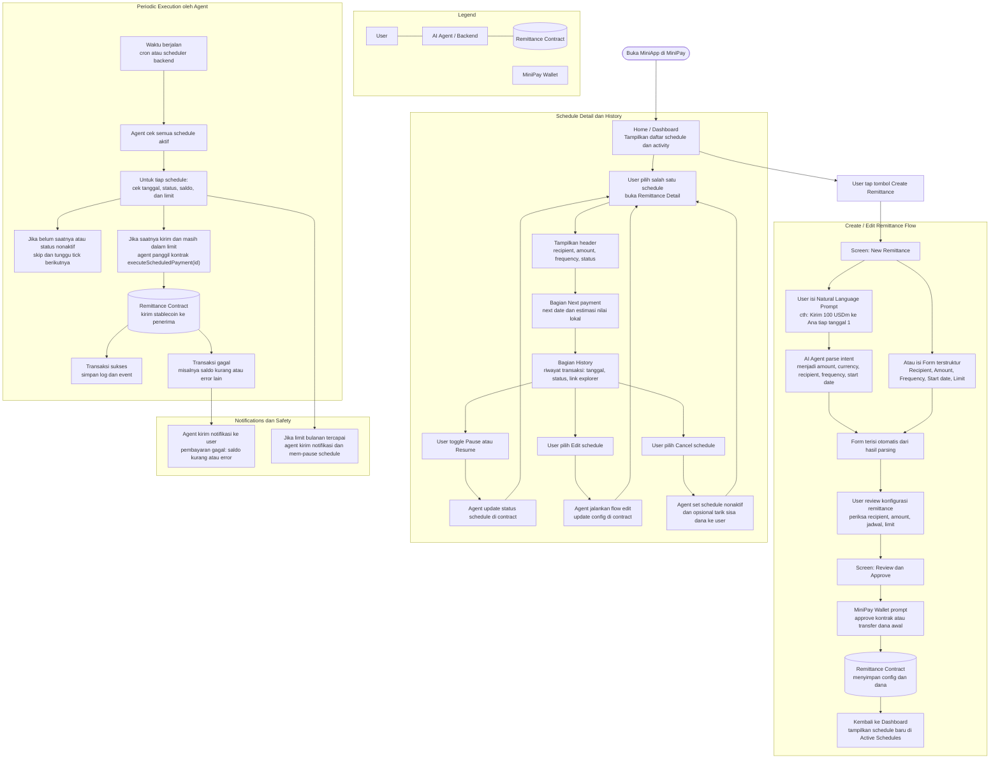

# Sendease

Sendease is a mobile-first, decentralized scheduled remittance MiniApp built on top of **Celo MiniPay**. It empowers users to automate recurring stablecoin transfers (using **USDm**) to family and friends. By integrating a natural language intent-parsing agent and an autonomous on-chain automation agent, Sendease makes periodic remittances as simple as sending a chat message.

---

## 🚀 Key Features

* **Natural Language Intent Parsing**: Describe your transfer in plain text (e.g., *"Kirim 100 USDm ke Ana tiap tanggal 1"*), and our agent will automatically extract parameters to pre-fill the creation form.
* **Autonomous Execution Engine**: A background cron service with real economic agency executes payments on behalf of users once schedules are due.
* **Safety & Limit Controls**: User-defined monthly safety limits (`maxMonthlyAmount`) to prevent unintended transfers.
* **ERC-8004 Identity Integration**: Registered agent identity on-chain for transparency and trust tracking via standard explorers.
* **Mobile-First Design**: Custom flat-color layout tailormade for Opera MiniPay viewport heights and connection speeds.

---

## 📂 Project Structure

This project is organized as a monorepo powered by **Turborepo**:

* [apps/web](file:///Users/vickyadifirmansyah/Documents/Projects/send-ease/apps/web) - The Next.js 16 frontend app loaded inside MiniPay.
* [apps/contracts](file:///Users/vickyadifirmansyah/Documents/Projects/send-ease/apps/contracts) - Smart contracts codebase (Foundry, Solidity, tests).

---

## 🔄 Workflow Diagram



---

## 📖 Developer Documentation

For deeper details regarding specifications and implementation plans:
* 📋 **[PRD.md](file:///Users/vickyadifirmansyah/Documents/Projects/send-ease/PRD.md)** - Product Requirements Document containing goals, target audience, functional specifications, and milestones.
* 🎨 **[DESIGN.md](file:///Users/vickyadifirmansyah/Documents/Projects/send-ease/DESIGN.md)** - Visual brand identity, flat color palette, typography guidelines, mobile constraints, and component designs.
* 🤖 **[AGENTS.md](file:///Users/vickyadifirmansyah/Documents/Projects/send-ease/AGENTS.md)** - AI Agent architecture, roles (intent vs automation), safety checks, and execution flows.
* 📊 **[DIAGRAM.mermaid](file:///Users/vickyadifirmansyah/Documents/Projects/send-ease/DIAGRAM.mermaid)** - Flowcharts representing creation, verification, and automated scheduler workflows.
* 🧪 **[TEST_CASE.md](file:///Users/vickyadifirmansyah/Documents/Projects/send-ease/TEST_CASE.md)** - High-level and detailed test cases for QA verification.

---

## 🛠️ Getting Started

### Prerequisites

* [PNPM](https://pnpm.io/) (v8+ or v9+ recommended)
* Node.js v18+
* [Foundry](https://book.getfoundry.sh/) (for smart contracts compilation & testing)

### Setup

1. **Install dependencies**:
   ```bash
   pnpm install
   ```

2. **Start the development servers**:
   ```bash
   pnpm dev
   ```
   This fires up the Next.js dev server (typically on `http://localhost:3000`) and watches for changes.

3. **Check/Compile Smart Contracts**:
   To compile and test smart contracts using Foundry:
   ```bash
   cd apps/contracts
   forge build
   forge test
   ```

### Deployment & Verification (Foundry)

Contracts are deployed using Foundry forge scripts:
* Deploy to Celo Mainnet / Sepolia:
  ```bash
  cd apps/contracts
  # Copy env and set your private key
  cp .env.example .env
  # Run the deploy script
  ./deploy-mainnet.sh
  ```

### ERC-8004 Agent Registration

To register the Sendease AI agent on-chain on the ERC-8004 registry:
1. Make sure your environment variables in `apps/web/.env.local` are set (`AGENT_PRIVATE_KEY` or `RELAYER_PRIVATE_KEY`).
2. Run the registration script:
   ```bash
   pnpm --filter web register-agent
   ```
3. To update the metadata URI:
   ```bash
   pnpm --filter web register-agent # or custom update script
   # or run directly:
   npx tsx apps/web/scripts/update-agent-uri.ts
   ```

---

## 🛡️ License

MIT License.
